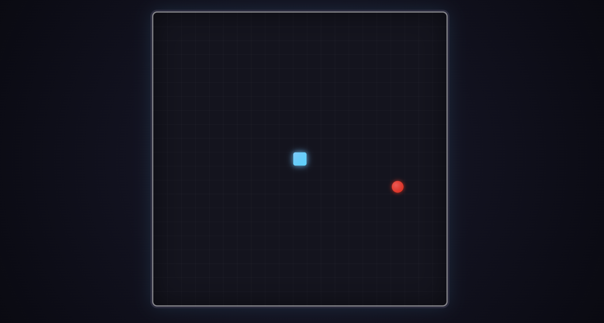
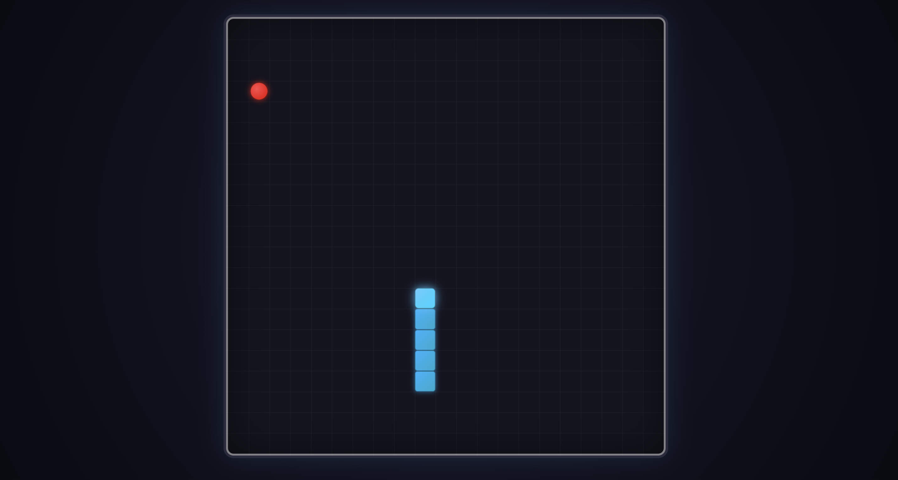

# Snake Game
A classic Snake game built from scratch using vanilla JavaScript (ES Modules), HTML5, and CSS Grid — no frameworks, no libraries, no build tools required.

## Preview
| Start of Game | Snake Growing |
|:---:|:---:|
|  |  |


## Features
- Smooth, frame-rate-independent game loop using `requestAnimationFrame`
- Grid-based rendering with CSS Grid (21x21 board)
- Snake movement, growth, and self-collision detection
- Randomized food spawning that avoids the snake's body
- Wall and self-collision game-over detection with restart prompt
- Reversal-lock input handling (prevents instantly turning back on yourself)
- Fully modular ES6 codebase — each concern lives in its own file
- Modern, styled UI with glow effects and grid visuals (no external assets)

## Demo Controls
| Key           | Action       |
|---------------|--------------|
| `Arrow Up`    | Move up      |
| `Arrow Down`  | Move down    |
| `Arrow Left`  | Move left    |
| `Arrow Right` | Move right   |

## Project Structure
```
snake-game/
├── index.html          # Entry point, defines the #game-board element
├── style.css            # Visual styling for the board, snake, and food
├── game.js               # Main game loop, orchestrates update/draw/death checks
├── snake.js              # Snake state, movement, growth, and collision logic
├── food.js                # Food state, spawning, and collision with snake
├── input.js                # Keyboard input handling and direction state
├── grid.js                  # Grid constants and boundary utilities
└── README.md
```

## Getting Started

### Prerequisites
Because this project uses native ES Modules (`import`/`export`), it must be served over `http://` or `https://` — opening `index.html` directly via `file://` will not work in most browsers due to CORS restrictions on module scripts.

### Run Locally
Any static file server will work. A few options:

**Using Python:**
```bash
python3 -m http.server 8000
```

**Using Node.js (with `serve`):**
```bash
npx serve .
```

**Using VS Code:**
Install the "Live Server" extension and click "Go Live."

Then open your browser to:
```
http://localhost:8000
```

### `index.html` Setup

Make sure `index.html` includes:

```html
<div id="game-board"></div>
<script type="module" src="game.js"></script>
```

The `type="module"` attribute is required for the `import`/`export` syntax used throughout the codebase.

## How It Works

### Game Loop
The core loop lives in `game.js` and uses `requestAnimationFrame` for smooth, display-synced rendering. Rather than updating every single frame (which would make the snake move far too fast), the loop throttles updates using `snackSpeed` (moves per second) and elapsed time:

```js
function main(currentTime) {
    if (gameOver) {
        if (confirm('You lost. Press ok to restart.')) {
            window.location = '/';
        }
        return;
    }

    window.requestAnimationFrame(main);
    const secondsSinceLastRender = (currentTime - lastRenderTime) / 1000;

    if (secondsSinceLastRender < 1 / snackSpeed) return;

    lastRenderTime = currentTime;
    update();
    draw();
}
```

Each tick:
1. **`update()`** — advances the snake, checks for food collisions, checks for death conditions.
2. **`draw()`** — clears the board and re-renders the snake and food at their current positions.

### Modules Overview

| Module      | Responsibility |
|-------------|-----------------|
| `grid.js`   | Defines the grid size and exposes `randomGridPosition()` and `outsideGrid()` for boundary checks. |
| `input.js`  | Listens for `keydown` events and exposes the current movement direction via `getInputDirection()`. Prevents 180° reversals. |
| `snake.js`  | Owns the snake's body array. Handles movement, growth (`expandSnack`), self-intersection checks, and rendering. |
| `food.js`   | Owns the food's position. Handles respawning at random valid positions and triggers snake growth on collision. |
| `game.js`   | Ties everything together: the render loop, death detection, and clearing/redrawing the board each frame. |

## Gameplay Rules

- The snake moves continuously in the current direction at a fixed interval, controlled by `snackSpeed`.
- Eating food (the snake's head occupying the food's grid cell) grows the snake by one segment and respawns the food at a new random position that isn't currently occupied by the snake.
- The game ends if the snake's head:
  - Moves outside the boundaries of the grid, or
  - Collides with any other segment of its own body.
- On game over, a confirmation dialog appears; accepting it reloads the game.

## Customization

A few values can be tweaked to change game feel:

**Speed** (`snake.js`):
```js
export const snackSpeed = 2; // moves per second — increase for a faster game
```

**Grid size** (`grid.js`):
```js
const GRID_SIZE = 21; // increase for a larger board
```

**Colors and visuals** (`style.css`):
```css
.snake {
    background: linear-gradient(135deg, hsl(200, 100%, 55%), hsl(190, 100%, 40%));
}

.food {
    background: radial-gradient(circle at 35% 35%, hsl(0, 100%, 65%), hsl(0, 100%, 45%));
}
```

## Browser Support
Works in all modern evergreen browsers that support:
- ES Modules (`<script type="module">`)
- CSS Grid
- `requestAnimationFrame`

This includes recent versions of Chrome, Firefox, Safari, and Edge. Internet Explorer is not supported.

## Known Limitations

- No score display or high-score tracking yet.
- No pause functionality.
- No mobile/touch controls — keyboard input only.
- No sound effects.

## Future Improvements

- [ ] Add an on-screen score counter
- [ ] Add pause/resume support
- [ ] Add touch/swipe controls for mobile devices
- [ ] Add sound effects for eating food and game over
- [ ] Add a start screen and difficulty selection
- [ ] Persist high scores using `localStorage`